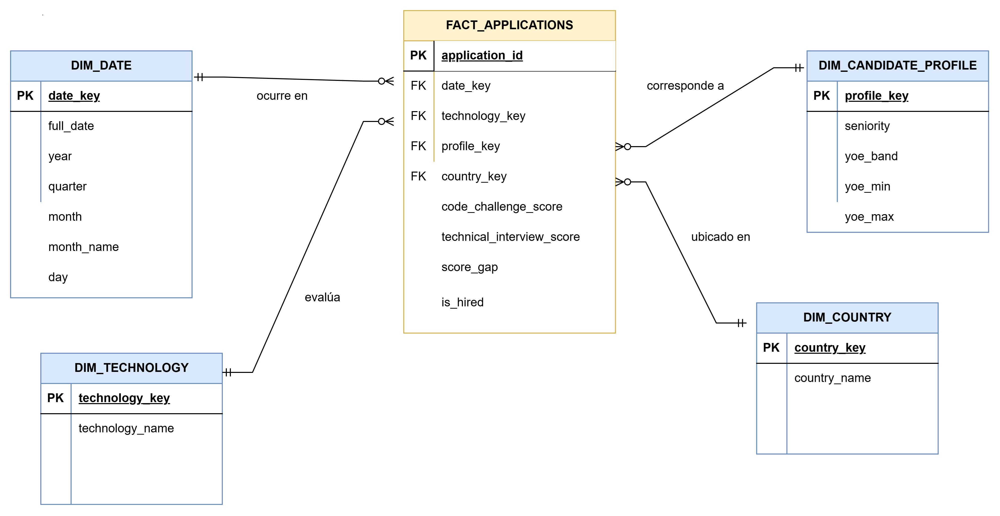

# Workshop 1: From Business Requirements to a Dimensional Data Warehouse

## Project Objective

The objective of this project is to simulate a real-world Data Engineering technical challenge by transforming raw operational candidate recruitment data into an analytical **Dimensional Data Warehouse** that directly supports specific business requirements and analytical decisions.

The project covers the complete ETL process, from extracting and preparing the raw candidate data to loading a dimensional model in MySQL and generating analytical outputs to answer the defined business requirements.

---

## Business Context

A technology recruitment company receives thousands of applications from candidates with diverse professional backgrounds, experience levels, countries, seniorities, and technology profiles.

Candidate performance is evaluated through two technical assessments:

- **Code Challenge Score**
- **Technical Interview Score**

The recruitment process uses these evaluations to determine whether a candidate is hired or not hired. The resulting Data Warehouse provides decision-makers with analytical insights into hiring patterns, candidate profiles, technology demand, country-level recruitment activity, and technical evaluation performance.

---

## Business Requirements

The project addresses five main business requirements:

### R1 — Hiring Trends

Monitor hiring trends over time to identify changes in recruitment outcomes across different periods.

### R2 — Technology Analysis

Compare hiring results across technologies to identify which technical profiles generate the largest number and proportion of hired candidates.

### R3 — Candidate Profile Analysis

Analyze hiring outcomes according to candidate seniority and years of professional experience (YOE).

### R4 — Country Analysis

Evaluate recruitment activity and hiring effectiveness by candidate country of origin to optimize sourcing investments.

### R5 — Technical Evaluation

Analyze the efficiency and consistency of technical evaluations by comparing Code Challenge Scores against Technical Interview Scores to identify the primary bottlenecks in the evaluation process.

---

## Requirements Traceability

| Requirement | Business Question | Data Required | Expected Analytical Output |
| :--- | :--- | :--- | :--- |
| **R1** | How have hiring results changed over time? | Application Date, Scores | Monthly time series of applications, hires, and hire rate (%) |
| **R2** | Which technologies generate the highest number and proportion of hired candidates? | Technology, Scores | Ranking of technologies by number of hires and hire rate (%) |
| **R3** | How do hiring results change by seniority and experience? | Seniority, YOE, Scores | Hire rate by seniority level and experience range |
| **R4** | Which countries generate the highest volume of applications and hire rates? | Country, Scores | Ranking of countries by application volume and hire rate |
| **R5** | Is there a gap between test scores, and which evaluation is the main bottleneck? | Code Challenge Score, Technical Interview Score | Average score gap and breakdown of candidates failing each test |

---

## Dataset Description

The source dataset contains approximately **50,000 candidate applications**.

The dataset includes the following attributes:

| Attribute | Description |
| :--- | :--- |
| **First Name** | Candidate's first name |
| **Last Name** | Candidate's last name |
| **Email** | Candidate's email address |
| **Country** | Candidate's country of origin |
| **Application Date** | Date when the application was submitted |
| **YOE** | Years of professional experience |
| **Seniority** | Candidate seniority level |
| **Technology** | Candidate's technical profile |
| **Code Challenge Score** | Score obtained in the Code Challenge |
| **Technical Interview Score** | Score obtained in the Technical Interview |

---

## Main Profiling Findings

The initial data profiling identified the following characteristics:

- The dataset contains **50,000 rows and 10 columns**.
- There are no critical missing values in the core analytical fields.
- Application dates span from **2018 to 2022**.
- Both technical evaluation scores range continuously from **0 to 10**.

These characteristics make the dataset suitable for the proposed dimensional modeling and analytical requirements.

---

## Business Process

**Business Process:** Technical candidate recruitment and selection.

Each candidate application represents an instance of the recruitment process. The application is evaluated through two technical assessments, and the results are used to determine a binary hiring outcome:

- **HIRED**
- **NOT HIRED**

---

## Grain Definition

The grain of the fact table is:

> **One row in `FactApplications` represents a single candidate application evaluated through the recruitment selection process, with a specific Code Challenge Score and Technical Interview Score and a resulting hiring outcome.**

This grain ensures that each application is represented as one measurable event in the Data Warehouse.

---

## Dimensional Model

The Data Warehouse follows a **Star Schema** architecture, separating descriptive information into dimensions and measurable recruitment events into the fact table.

### Star Schema Diagram



---

## Dimensions and Fact Table

### `DimDate`

Stores calendar-related information required to analyze hiring trends over time.

Main attributes:

- `date_key`
- `full_date`
- `year`
- `quarter`
- `month`
- `month_name`
- `day`

### `DimTechnology`

Stores the technical profile associated with each candidate application.

Main attributes:

- `technology_key`
- `technology_name`

### `DimCandidateProfile`

Groups candidates according to their seniority and professional experience.

Main attributes:

- `profile_key`
- `seniority`
- `yoe_band`
- `yoe_min`
- `yoe_max`

### `DimCountry`

Stores candidate country information to support geographic recruitment analysis.

Main attributes:

- `country_key`
- `country_name`

### `FactApplications`

Stores the measurable events associated with each candidate application and the foreign keys connecting the fact table to the dimensions.

Main attributes:

- `date_key`
- `technology_key`
- `profile_key`
- `country_key`
- `code_challenge_score`
- `technical_interview_score`
- `score_gap`
- `is_hired`

---

## ETL Architecture & Transformation Decisions

The project implements a four-stage ETL pipeline:

### 1. Extract

The raw dataset is read from:

```text
data/raw/candidates.csv
```

The data is loaded into a Pandas DataFrame without applying business transformations during the extraction stage.

### 2. Transform

The transformation stage prepares the data for analytical processing.

The main transformations include:

- Cleaning data formats.
- Handling appropriate data types.
- Preparing attributes for dimensional modeling.
- Creating the hiring outcome.
- Calculating the score gap between technical evaluations.

### Hiring Business Rule

The core hiring rule is:

```text
IF Code Challenge Score >= 7
AND Technical Interview Score >= 7
THEN HIRED
ELSE NOT HIRED
```

Therefore, a candidate must achieve a score of at least **7 in both technical evaluations** to be classified as hired.

### 3. Dimensional Transformation

The prepared records are mapped to the corresponding dimension records using **surrogate keys**.

The fact table then stores these keys as foreign keys to maintain the relationships between candidate applications and their descriptive dimensions.

### 4. Load

The dimensional Data Warehouse is created in MySQL.

The loading process inserts the dimensions first and then the fact table:

1. `DimDate`
2. `DimTechnology`
3. `DimCandidateProfile`
4. `DimCountry`
5. `FactApplications`

This order preserves **referential integrity** between the dimension and fact tables.

---

## Technologies Used

| Technology | Purpose |
| :--- | :--- |
| **Python** | ETL pipeline implementation |
| **Pandas** | Data extraction and transformation |
| **MySQL** | Dimensional Data Warehouse |
| **SQLAlchemy** | Database connectivity and interaction |
| **Git** | Version control |
| **GitHub** | Repository and project management |

---

## Project Structure

The main project structure is organized as follows:

```text
.
├── data/
│   └── raw/
│       └── candidates.csv
│
├── diagrams/
│   └── star_schema.png
│
├── notebooks/
│   └── data_profiling.ipynb
│
├── src/
│   └── db_config.py
│   └── dimensional_model.py
│   └── extract.py
│   └── load.py
│   └── main.py
│   └── queries.py
│   └── transform.py
│ 
├── sql/
│   └── analytical_queries.sql
│   └── create_tables.sql
│ 
├── docs/
│   └── ETL_2026-2_Workshop-1
│   └── Workshop-1
│
├── results/
│
├── .env
├── requirements.txt
└── README.md
```

---

## Instructions to Run the Project

### 1. Clone the Repository

Clone the repository and navigate to the project root:

```bash
git clone <repository-url>
cd <repository-folder>
```

### 2. Create a Python Virtual Environment

On Windows:

```bash
python -m venv venv
venv\Scripts\activate
```

On macOS/Linux:

```bash
python3 -m venv venv
source venv/bin/activate
```

### 3. Install Dependencies

Install the required Python packages:

```bash
pip install -r requirements.txt
```

### 4. Configure Environment Variables

Create a `.env` file based on `.env.example` and configure your local MySQL credentials.

For example:

```text
DB_HOST=localhost
DB_PORT=3306
DB_USER=your_user
DB_PASSWORD=your_password
DB_NAME=recruitment_dw
```

> **Important:** Do not commit the `.env` file if it contains real database credentials.

### 5. Run the ETL Pipeline

Execute the main pipeline:

```bash
python src/main.py
```

The pipeline will extract the raw candidate data, transform it according to the defined business rules, create/load the dimensional Data Warehouse, and generate the analytical outputs.

---

## Analytical Queries and KPIs

All analytical outputs are generated through queries executed against the MySQL Data Warehouse:

```text
recruitment_dw
```

The analytical layer addresses the five business requirements through the following KPIs and analyses:

| Requirement | Main KPIs / Analysis |
| :--- | :--- |
| **R1 — Hiring Trends** | Applications by month, hires by month, monthly hire rate |
| **R2 — Technology Analysis** | Hires by technology, applications by technology, technology hire rate |
| **R3 — Candidate Profile** | Hire rate by seniority and YOE band |
| **R4 — Country Analysis** | Applications by country, hires by country, country hire rate |
| **R5 — Technical Evaluation** | Average score gap, Code Challenge failures, Technical Interview failures |

---

## Main Business Findings

### R1 — Hiring Trends

Hire rates remain relatively stable from month to month, with the highest observed hire rate reaching **16.96% in July 2022**.

### R2 — Technology Analysis

**Game Development** generated the highest volume of hires, with **519 hired candidates** and a **13.59% success rate**.

### R3 — Candidate Profile Analysis

**Interns with Entry-level experience (0–2 YOE)** achieved the highest conversion rate, reaching **17.11%**.

### R4 — Country Analysis

**Malawi** presented the highest application volume, with **242 applications** and a **9.50% hire rate**.

### R5 — Technical Evaluation

The **Code Challenge** was a slightly more common single failure point, with **11,571 failures**, compared with **11,534 failures** in the Technical Interview.

---

## Final Requirements Validation

All five business requirements (**R1–R5**) have been implemented and addressed using the dimensional Data Warehouse.

The solution was validated through referential integrity checks and analytical queries executed against the `recruitment_dw` database.

The resulting Data Warehouse supports analysis of:

- Hiring trends over time.
- Hiring performance by technology.
- Candidate seniority and professional experience.
- Recruitment activity and effectiveness by country.
- Technical evaluation performance and potential bottlenecks.

---

## Conclusion

This workshop demonstrates the complete process of transforming operational recruitment data into an analytical **Dimensional Data Warehouse**.

The implementation connects business requirements with a structured Star Schema, applies explicit business rules during the ETL process, and provides analytical queries and KPIs that allow decision-makers to evaluate recruitment performance from multiple perspectives.

The resulting solution provides a structured foundation for analyzing **when candidates are hired, which technologies perform best, which candidate profiles have higher conversion rates, where applications are coming from, and which technical evaluation represents the main bottleneck in the recruitment process**.